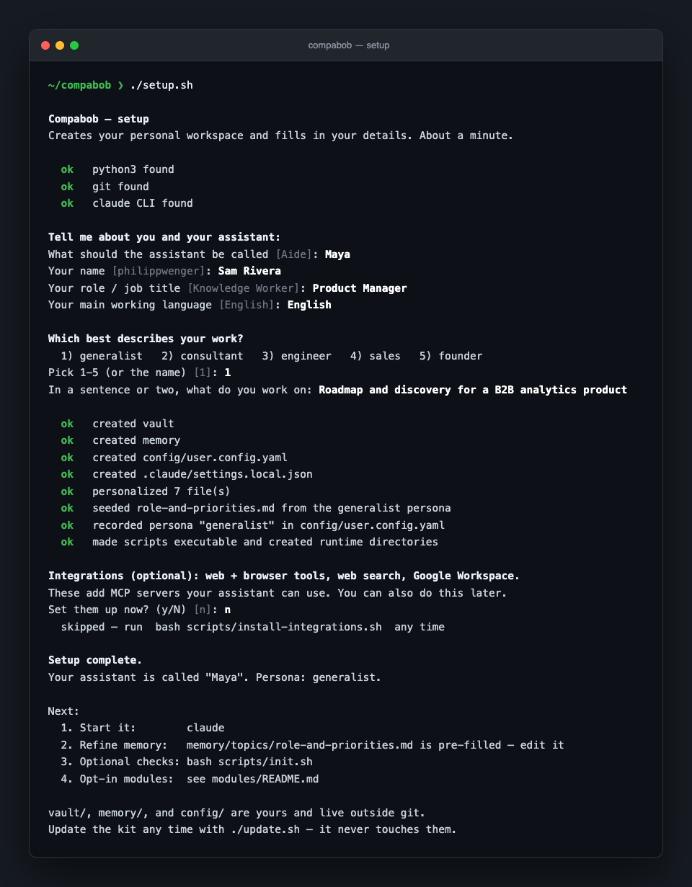

# Compabob

[English](../README.md) | [Español](README.es.md)

## Por qué

Una sesión nueva de Claude Code es una generalista competente que no sabe nada de ti. Cada vez tienes que volver a explicarle quién eres, cómo quieres las respuestas y en qué estás trabajando. No tiene noción de tus prioridades, ni barreras de seguridad sobre lo que se envía, ni un lugar donde guardar lo que aprende.

Compabob es la estructura que faltaba. El ciclo fundamental, desde el primer día:

> Le pides que tome notas de la reunión de planificación de hoy. Las archiva en tu base de conocimiento. La semana siguiente, antes del seguimiento, escribes `/meeting-prep` y te devuelve los asistentes, lo que se decidió y los temas pendientes, sin que tengas que buscar nada.

Ese ciclo de segundo cerebro es el valor que obtienes de inmediato. Compabob es un andamio, no un asistente terminado: todo lo demás se multiplica a medida que lo haces tuyo.

## Qué es (y qué no es)

- **Es**: una plantilla con opinión propia para un solo usuario. Arquitectura, convenciones y un conjunto de agentes, hooks y skills que requirieron verdadera iteración para dar en el clavo, empaquetados para que no empieces desde cero.
- **No es**: un producto, un SaaS ni una caja mágica sin configuración. No hay registro, ni telemetría, ni ventas adicionales. Funciona completamente en tu máquina bajo tu propia suscripción de Claude Code.

## Estado de mantenimiento

**Mantenimiento activo.** Este kit se actualiza con el tiempo a medida que sus mantenedores aprenden qué funciona y conforme Claude Code evoluciona, así que espera que siga mejorando. Sigues siendo dueño absoluto de tu copia: haz fork, cámbialo todo, aléjate todo lo que quieras. Las issues y PRs son bienvenidas; las revisiones se hacen con el tiempo disponible, ya que el kit se mantiene junto con otros trabajos.

## Verlo en acción



Un solo script. Te pregunta quién eres y qué haces, crea tu vault, memoria y configuración a partir de las semillas incluidas, aplica un preset de personalidad y ya estás listo para empezar.

## Inicio rápido

¿Te manejas con la terminal? Tres comandos:

```bash
git clone https://github.com/chacosoldier/compabob.git
cd compabob
./setup.sh
```
